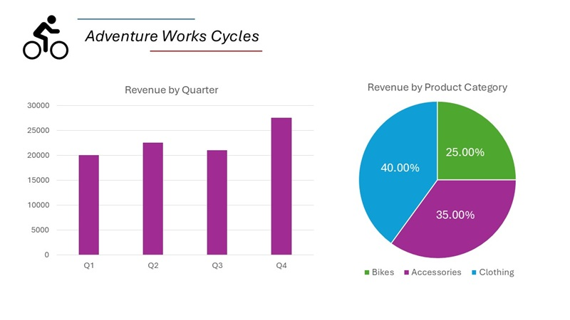

---
lab:
  title: 從多模式內容擷取資訊
  description: 使用 Azure AI 內容瞭解，從文件、影像、音訊錄製內容和視訊中擷取深入解析。
---

# 從多模式內容擷取資訊

在這項練習中，您會使用 Azure 內容瞭解，從各種內容類型中擷取資訊，包括發票、包含圖表的投影片影像、語音訊息的音訊錄製內容，以及電話會議的視訊錄影。

此練習大約需要 **40 分鐘**。

## 建立 Azure AI Foundry 中樞與專案

我們將在這項練習中使用的 Azure AI Foundry 功能，需要以 Azure AI Foundry 中樞** 資源為基礎的專案。

1. 在網頁瀏覽器中，開啟 [Azure AI Foundry 入口網站](https://ai.azure.com) 於`https://ai.azure.com` 並使用您的 Azure 認證登入。 關閉首次登入時開啟的所有提示或快速啟動窗格，如有必要，使用左上角的 **Azure AI Foundry** 標誌瀏覽到首頁，首頁類似於下圖（若 [說明]**** 窗格已開啟，請將其關閉）：

    

1. 在瀏覽器中，先瀏覽至 `https://ai.azure.com/managementCenter/allResources`，再選取 [建立新項目]****。 然後選擇選項，以便建立**新的 AI 中心資源**。
1. 在 [建立專案]**** 精靈中，輸入專案有效名稱，然後選取建立新中樞的選項。 接著使用 [重新命名中樞]**** 連結，為新中樞指定有效名稱，展開 [進階選項]****，然後指定專案的下列設定：
    - **訂用帳戶**：您的 Azure 訂用帳戶**
    - **資源群組**：建立或選取資源群組**
    - **區域**： 選取下列其中一個位置 (*撰寫本文時，Azure AI 內容瞭解僅適用於這些區域*)：
        - 澳大利亞東部
        - 瑞典中部
        - 美國西部

    > **注意**：如果您位處使用原則來限制允許之資源名稱的 Azure 訂閱中，則可能需要使用 [建立新專案]**** 對話方塊底部的連結，才能使用 Azure 入口網站建立中樞。

    > **秘訣**：如果 [建立]**** 按鈕仍然停用，請將您的中樞重新命名為唯一的英數字元值。

1. 等候您的專案建立。

## 下載 內容

您即將分析的內容位於.zip 封存中。 請下載並將之解壓縮至本機資料夾。

1. 在新的瀏覽器分頁中，從 `https://github.com/microsoftlearning/mslearn-ai-information-extraction/raw/main/Labfiles/content/content.zip` 下載 [content.zip](https://github.com/microsoftlearning/mslearn-ai-information-extraction/raw/main/Labfiles/content/content.zip)，然後儲存到本機資料夾。
1. 解壓縮已下載的 *content.zip* 檔案，檢視其中包含的檔案。 您將在這項練習中，用這些檔案建立各種內容瞭解分析器。

> **注意**：如果您只想探索特定形式的分析 (文件、影像、視訊或音訊)，則可跳至下方的相關工作。 為了獲得最佳體驗，請瀏覽每個工作，學習如何從不同類型的內容中擷取資訊。

## 從發票文件中擷取資訊

您即將建立 Azure AI 內容瞭解分析器，以便從發票中擷取資訊。 您將首先根據範例發票定義一個模式。

### 定義發票分析的結構描述

1. 前往包含 Azure AI Foundry 專案首頁的瀏覽器分頁，然後在左側的瀏覽窗格中，選取 [內容瞭解]****。
1. 在 [內容瞭解]**** 頁面上，選取頂部的 [自訂工作]**** 分頁。
1. 在 [內容瞭解] 自訂工作頁面上，選取 [+ 建立]****，然後使用以下設定建立工作：
    - **工作名稱**：`Invoice analysis`
    - **描述**：`Extract data from an invoice`
    - **單一檔案內容分析**：*已選取*
    - **進階設定**：
        - **Azure AI 服務連線**：*Azure AI Foundry 中樞內的 Azure AI 服務資源*
        - **Azure Blob 儲存體帳戶**：*Azure AI Foundry 中心中的儲存體帳戶*
1. 等待工作建立。

    > **提示**：如果存取儲存體時發生錯誤，請等待片刻，然後重試。 新中樞的存取權限可能需要幾分鐘才能散佈。

1. 在 [定義結構描述]**** 頁面上，從解壓縮內容檔案的資料夾上傳 **invoice-1234.pdf** 檔案。 此檔案包含下列發票：

    

1. 上傳發票檔案後，在 [定義結構描述]**** 頁面上，選取 [發票資料擷取]**** 範本，然後選取 [建立]****。

    [發票分析]** 範本包含發票內的常見欄位。 您可以使用結構描述編輯器刪除任何不需要的建議欄位，並新增任何需要的自訂欄位。

1. 在建議的欄位清單中，選取 **[BillingAddress]**。 您上傳的發票格式不需要此欄位，因此請使用所選欄位資料列上出現的 [刪除欄位]**** (**&#128465;**) 圖示將其刪除。
1. 現在請刪除下列建議欄位，這些欄位不是您發票結構描述需要的欄位：
    - BillingAddressRecipient
    - BillingAddressRecipient
    - CustomerId
    - CustomerTaxId
    - 到期日期
    - InvoiceTotal
    - PaymentTerm
    - PreviousUnpaidBalance
    - PurchaseOrder
    - RemittanceAddress
    - RemittanceAddressRecipient
    - ServiceAddress
    - BillingAddressRecipient
    - ShippingAddress
    - BillingAddressRecipient
    - TotalDiscount
    - VendorAddressRecipient
    - VendorTaxId
    - TaxDetails
1. 使用 [+ 新增欄位]**** 按鈕新增下列欄位，為每個新欄位選取 [儲存變更]**** (**&#10003;**)：

    | 欄位名稱 | 欄位描述 | 值類型 | 方法 |
    |--|--|--|--|
    | `VendorPhone` | `Vendor telephone number` | String | Extract |
    | `ShippingFee` | `Fee for shipping` | 數字 | Extract |

1. 請注意，在 [項目]**** 欄位資料列上，此欄位為*資料表* (包含發票內的項目集合)。 選取 [編輯]**** (&#9638;) 圖示即可開啟具有其子欄位的新頁面。
1. 從 [項目]**** 資料表移除下列子欄位：
    - Date
    - ProductCode
    - 單位
    - TaxAmount
    - TaxRate
1. 使用 [確定]**** 按鈕確認變更，然後返回發票結構描述的頂層。

1. 驗證您完成的結構描述是否如下所示，然後選取 [儲存]****。

    

1. 在 **測試分析器** 頁面，如果分析未自動開始，請選取 **執行分析**。 接著等待分析完成。

1. 檢閱分析結果，結果應與此類似：

    

1. 檢視 [欄位]**** 窗格內找到的欄位詳細資料。

### 建立和測試發票分析器

現在您已經訓練了一個模型來從發票中擷取欄位，您可以組建一個分析器來與類似的文件一起使用。

1. 選取 [分析器清單]**** 頁面，然後選取 [+ 組建分析器]**** 並使用以下屬性 (輸入內容與此處所示完全相同) 組建一個新的分析器：
    - **名稱**：`invoice-analyzer`
    - **描述**：`Invoice analyzer`
1. 等待新的分析器準備就緒（使用**重新整理**按鈕進行檢查）。
1. 建立分析器之後，選取 [發票分析器]**** 連結。 分析器結構描述中定義的欄位隨即顯示。
1. 在 [發票分析器]**** 頁面中，選取 [測試]**** 分頁。
1. 使用 [+ 上傳測試檔案]**** 按鈕，從您解壓縮內容檔案的資料夾上傳 **invoice-1235.pdf** 檔案，然後按一下 [執行分析]****，即可從發票中擷取欄位資料。

    分析後的發票看起來像這樣：

    

1. 檢閱 [欄位]**** 窗格，驗證分析器是否從測試發票中擷取了正確的欄位。
1. 檢閱 [結果]**** 窗格，查看分析器傳回用戶端應用程式的 JSON 回應。
1. 在 [程式碼範例]**** 分頁中，檢視您可以用來開發使用內容瞭解 REST 介面，呼叫分析器之用戶端應用程式的範例程式碼。
1. 關閉 [發票分析器]**** 頁面。

## 從投影片影像中擷取資訊

您即將建立 Azure AI 內容瞭解分析器，以便從包含圖表的投影片中擷取資訊。

### 定義影像分析的結構描述

1. 前往包含 Azure AI Foundry 專案首頁的瀏覽器分頁，然後在左側的瀏覽窗格中，選取 [內容瞭解]****。
1. 在 [內容瞭解]**** 頁面上，選取頂部的 [自訂工作]**** 分頁。
1. 在 [內容瞭解] 自訂工作頁面上，選取 [+ 建立]****，然後使用以下設定建立工作：
    - **工作名稱**：`Slide analysis`
    - **描述**：`Extract data from an image of a slide`
    - **單一檔案內容分析**：*已選取*
    - **進階設定**：
        - **Azure AI 服務連線**：*Azure AI Foundry 中樞內的 Azure AI 服務資源*
        - **Azure Blob 儲存體帳戶**：*Azure AI Foundry 中心中的儲存體帳戶*
1. 等待工作建立。

    > **提示**：如果存取儲存體時發生錯誤，請等待片刻，然後重試。 新中樞的存取權限可能需要幾分鐘才能散佈。

1. 在 [定義結構描述]**** 頁面上，從解壓縮內容檔案的資料夾上傳 **slide-1.jpg** 檔案。 接著選取 [影像分析]**** 範本，然後選取 [建立]****。

    [影像分析]** 範本不包含任何預先定義的欄位。 您必須定義欄位來描述想要擷取的資訊。

1. 使用 [+ 新增欄位]**** 按鈕新增下列欄位，為每個新欄位選取 [儲存變更]**** (**&#10003;**)：

    | 欄位名稱 | 欄位描述 | 值類型 | 方法 |
    |--|--|--|--|
    | `Title` | `Slide title` | String | 產生 |
    | `Summary` | `Summary of the slide` | String | 產生 |
    | `Charts` | `Number of charts on the slide` | 整數 | 產生 |

1. 使用 [+ 新增欄位]**** 按鈕，新增名為 `QuarterlyRevenue` 且具備 `Revenue per quarter` 描述與 [資料表]**** 實值型別的欄位，然後儲存新欄位 (**&#10003;**)。 然後，在開啟之資料表子欄位的新頁面中，新增下列子欄位：

    | 欄位名稱 | 欄位描述 | 值類型 | 方法 |
    |--|--|--|--|
    | `Quarter` | `Which quarter?` | String | 產生 |
    | `Revenue` | `Revenue for the quarter` | 數字 | 產生 |

1. 選取 [返回]**** (靠近 [新增子欄位]**** 按鈕的箭頭圖示) 或 [&#10003;確定]**** 來返回結構描述頂層，然後用 [+ 新增欄位]**** 按鈕新增名為 `ProductCategories`，且具備 `Product categories` 描述與 [資料表]**** 實值型別的欄位，然後儲存新欄位 (**&#10003;**)。 然後，在開啟之資料表子欄位的新頁面中，新增下列子欄位：

    | 欄位名稱 | 欄位描述 | 值類型 | 方法 |
    |--|--|--|--|
    | `ProductCategory` | `Product category name` | String | 產生 |
    | `RevenuePercentage` | `Percentage of revenue` | 數字 | 產生 |

1. 選取 [返回]**** (靠近 [新增子欄位]**** 按鈕的箭頭圖示) 或 [&#10003;確定]**** 來返回結構描述頂層，然後驗證畫面是否如下所示。 然後選取**儲存**。

    

1. 在 **測試分析器** 頁面，如果分析未自動開始，請選取 **執行分析**。 接著等待分析完成。

    分析後的投影片看起來像這樣：

    

1. 檢閱分析結果，結果應與此類似：

    

1. 查看 [欄位]**** 窗格中找到的欄位詳細資料，展開 [QuarterlyRevenue]**** 和 [ProductCategories]**** 欄位來檢視子欄位的值。

### 組建並測試分析器

現在您已經訓練了一個模型來從投影片中擷取欄位，您可以組建一個分析器來與類似的投影片影像一起使用。

1. 選取 [分析器清單]**** 頁面，然後選取 [+ 組建分析器]**** 並使用以下屬性 (輸入內容與此處所示完全相同) 組建一個新的分析器：
    - **名稱**：`slide-analyzer`
    - **描述**：`Slide image analyzer`
1. 等待新的分析器準備就緒（使用**重新整理**按鈕進行檢查）。
1. 建立分析器之後，選取 [投影片分析器]**** 連結。 分析器結構描述中定義的欄位隨即顯示。
1. 在 [投影片分析器]**** 頁面中，選取 [測試]**** 分頁。
1. 使用 [+ 上傳測試檔案]**** 按鈕，從您解壓縮內容檔案的資料夾上傳 **slide-2.jpg** 檔案，然後按一下 [執行分析]****，即可從影像中擷取欄位資料。

    分析後的投影片看起來像這樣：

    

1. 檢閱 [欄位]**** 窗格，驗證分析器是否從投影片影像中擷取了正確的欄位。

    > **注意**：投影片 2 不包含依產品類別劃分的細項，因此找不到產品類別營收資料。

1. 檢閱 [結果]**** 窗格，查看分析器傳回用戶端應用程式的 JSON 回應。
1. 在 [程式碼範例]**** 分頁中，檢視您可以用來開發使用內容瞭解 REST 介面，呼叫分析器之用戶端應用程式的範例程式碼。
1. 關閉 [投影片分析器]**** 頁面。

## 從語音信箱音訊錄製內容中擷取資訊

您即將建立 Azure AI 內容瞭解分析器，以便從語音信箱訊息的音訊錄製內容中擷取資訊。

### 定義音訊分析的結構描述

1. 前往包含 Azure AI Foundry 專案首頁的瀏覽器分頁，然後在左側的瀏覽窗格中，選取 [內容瞭解]****。
1. 在 [內容瞭解]**** 頁面上，選取頂部的 [自訂工作]**** 分頁。
1. 在 [內容瞭解] 自訂工作頁面上，選取 [+ 建立]****，然後使用以下設定建立工作：
    - **工作名稱**：`Voicemail analysis`
    - **描述**：`Extract data from a voicemail recording`
    - **單一檔案內容分析**：*已選取*
    - **進階設定**：
        - **Azure AI 服務連線**：*Azure AI Foundry 中樞內的 Azure AI 服務資源*
        - **Azure Blob 儲存體帳戶**：*Azure AI Foundry 中心中的儲存體帳戶*
1. 等待工作建立。

    > **提示**：如果存取儲存體時發生錯誤，請等待片刻，然後重試。 新中樞的存取權限可能需要幾分鐘才能散佈。

1. 在 [定義結構描述]**** 頁面上，從解壓縮內容檔案的資料夾上傳 **call-1.mp3** 檔案。 接著選取 [語音文字記錄分析]**** 範本，然後選取 [建立]****。
1. 在右側的 [內容]**** 窗格中，選取 [取得謄寫預覽]****，查看已錄製訊息的謄寫內容。

    [語音文字記錄分析]** 範本不包含任何預先定義的欄位。 您必須定義欄位來描述想要擷取的資訊。

1. 使用 [+ 新增欄位]**** 按鈕新增下列欄位，為每個新欄位選取 [儲存變更]**** (**&#10003;**)：

    | 欄位名稱 | 欄位描述 | 值類型 | 方法 |
    |--|--|--|--|
    | `Caller` | `Person who left the message` | String | 產生 |
    | `Summary` | `Summary of the message` | String | 產生 |
    | `Actions` | `Requested actions` | String | 產生 |
    | `CallbackNumber` | `Telephone number to return the call` | String | 產生 |
    | `AlternativeContacts` | `Alternative contact details` | 字串清單 | 產生 |

1. 請驗證您的結構描述是否看起來如下所示。 然後選取**儲存**。

    

1. 在 **測試分析器** 頁面，如果分析未自動開始，請選取 **執行分析**。 接著等待分析完成。

    音訊分析可能需要一些時間。 等待時，您可以播放下列音訊檔案：

    <video controls src="https://github.com/MicrosoftLearning/mslearn-ai-information-extraction/raw/refs/heads/main/Instructions/Labs/media/call-1.mp4" title="呼叫 1" width="300">
        <track src="https://github.com/MicrosoftLearning/mslearn-ai-information-extraction/raw/refs/heads/main/Instructions/Labs/media/call-1.vtt" kind="captions" srclang="en" label="English">
    </video>

    **注意**：此音訊為 AI 生成。

1. 檢閱分析結果，結果應與此類似：

    

1. 查看 [欄位]**** 窗格中找到的欄位詳細資料，展開 [AlternativeContacts]**** 欄位來檢視列出的值。

### 組建並測試分析器

現在您已經訓練了一個模型來從語音訊息中擷取欄位，您可以組建一個分析器來與類似的音訊錄製內容一起使用。

1. 選取 [分析器清單]**** 頁面，然後選取 [+ 組建分析器]**** 並使用以下屬性 (輸入內容與此處所示完全相同) 組建一個新的分析器：
    - **名稱**：`voicemail-analyzer`
    - **描述**：`Voicemail audio analyzer`
1. 等待新的分析器準備就緒（使用**重新整理**按鈕進行檢查）。
1. 建立分析器之後，選取 [語音信箱分析器]**** 連結。 分析器結構描述中定義的欄位隨即顯示。
1. 在 [語音信箱分析器]**** 頁面中，選取 [測試]**** 分頁。
1. 使用 [+ 上傳測試檔案]**** 按鈕，從您解壓縮內容檔案的資料夾上傳 **call-2.mp3** 檔案，然後按一下 [執行分析]****，即可從音訊檔案中擷取欄位資料。

    音訊分析可能需要一些時間。 等待時，您可以播放下列音訊檔案：

    <video controls src="https://github.com/MicrosoftLearning/mslearn-ai-information-extraction/raw/refs/heads/main/Instructions/Labs/media/call-2.mp4" title="呼叫 2" width="300">
        <track src="https://github.com/MicrosoftLearning/mslearn-ai-information-extraction/raw/refs/heads/main/Instructions/Labs/media/call-2.vtt" kind="captions" srclang="en" label="English">
    </video>

    **注意**：此音訊為 AI 生成。

1. 檢閱 [欄位]**** 窗格，驗證分析器是否從語音訊息中擷取了正確的欄位。
1. 檢閱 [結果]**** 窗格，查看分析器傳回用戶端應用程式的 JSON 回應。
1. 在 [程式碼範例]**** 分頁中，檢視您可以用來開發使用內容瞭解 REST 介面，呼叫分析器之用戶端應用程式的範例程式碼。
1. 關閉 [語音信箱分析器]**** 頁面。

## 從視訊會議錄製內容中擷取資訊

您即將建立 Azure AI 內容瞭解分析器，以便從電話會議的視訊錄製內容中擷取資訊。

### 定義視訊分析的結構描述

1. 前往包含 Azure AI Foundry 專案首頁的瀏覽器分頁，然後在左側的瀏覽窗格中，選取 [內容瞭解]****。
1. 在 [內容瞭解]**** 頁面上，選取頂部的 [自訂工作]**** 分頁。
1. 在 [內容瞭解] 自訂工作頁面上，選取 [+ 建立]****，然後使用以下設定建立工作：
    - **工作名稱**：`Conference call video analysis`
    - **描述**：`Extract data from a video conference recording`
    - **單一檔案內容分析**：*已選取*
    - **進階設定**：
        - **Azure AI 服務連線**：*Azure AI Foundry 中樞內的 Azure AI 服務資源*
        - **Azure Blob 儲存體帳戶**：*Azure AI Foundry 中心中的儲存體帳戶*
1. 等待工作建立。

    > **提示**：如果存取儲存體時發生錯誤，請等待片刻，然後重試。 新中樞的存取權限可能需要幾分鐘才能散佈。

1. 在 [定義結構描述]**** 頁面上，從解壓縮內容檔案的資料夾上傳 **meeting-1.mp4** 檔案。 接著選取 [視訊分析]**** 範本，然後選取 [建立]****。
1. 在右側的 [內容]**** 窗格中，選取 [取得謄寫預覽]****，查看已錄製訊息的謄寫內容。

    [視訊分析]** 範本會擷取視訊的資料。 其中不包含任何預先定義的欄位。 您必須定義欄位來描述想要擷取的資訊。

1. 使用 [+ 新增欄位]**** 按鈕新增下列欄位，為每個新欄位選取 [儲存變更]**** (**&#10003;**)：

    | 欄位名稱 | 欄位描述 | 值類型 | 方法 |
    |--|--|--|--|
    | `Summary` | `Summary of the discussion` | String | 產生 |
    | `Participants` | `Count of meeting participants` | 整數 | 產生 |
    | `ParticipantNames` | `Names of meeting participants` | 字串清單 | 產生 |
    | `SharedSlides` | `Descriptions of any PowerPoint slides presented` | 字串清單 | 產生 |
    | `AssignedActions` | `Tasks assigned to participants` | Table |  |

1. 輸入 [AssignedActions]**** 欄位時，請在顯示的子欄位資料表上建立以下子欄位：

    | 欄位名稱 | 欄位描述 | 值類型 | 方法 |
    |--|--|--|--|
    | `Task` | `Description of the task` | String | 產生 |
    | `AssignedTo` | `Who the task is assigned to` | String | 產生 |

1. 選取 [返回]**** (靠近 [新增子欄位]**** 按鈕的箭頭圖示) 或 [&#10003;確定]**** 來返回結構描述頂層，然後驗證畫面是否如下所示。 然後選取**儲存**。

1. 請驗證您的結構描述是否看起來如下所示。 然後選取**儲存**。

    

1. 在 **測試分析器** 頁面，如果分析未自動開始，請選取 **執行分析**。 接著等待分析完成。

    視訊分析可能需要一些時間。 等待時，您可以檢視以下影片：

    <video controls src="https://github.com/MicrosoftLearning/mslearn-ai-information-extraction/raw/refs/heads/main/Instructions/Labs/media/meeting-1.mp4" title="會議 1" width="480">
        <track src="https://github.com/MicrosoftLearning/mslearn-ai-information-extraction/raw/refs/heads/main/Instructions/Labs/media/meeting-1.vtt" kind="captions" srclang="en" label="English">
    </video>

    **注意**：此影片為 AI 生成。

1. 分析完成後，請檢閱結果，其內容應如下所示：

    

1. 在 [欄位]**** 窗格中，檢視視訊的擷取資料，包括您新增的欄位。 檢視產生的欄位值，並視需求展開清單和表格欄位。

### 組建並測試分析器

現在您已經訓練了一個模型來從電話會議錄製內容中擷取欄位，您可以組建一個分析器來與類似的視訊一起使用。

1. 選取 [分析器清單]**** 頁面，然後選取 [+ 組建分析器]**** 並使用以下屬性 (輸入內容與此處所示完全相同) 組建一個新的分析器：
    - **名稱**：`conference-call-analyzer`
    - **描述**：`Conference call video analyzer`
1. 等待新的分析器準備就緒（使用**重新整理**按鈕進行檢查）。
1. 建立分析器之後，選取 [電話會議分析器]**** 連結。 分析器結構描述中定義的欄位隨即顯示。
1. 在 [電話會議分析器]**** 頁面中，選取 [測試]**** 分頁。
1. 使用 [上傳測試檔案]**** 按鈕，從您解壓縮內容檔案的資料夾上傳 **meeting-2.mp4** 檔案，然後執行分析，即可從音訊檔案中擷取欄位資料。

    視訊分析可能需要一些時間。 等待時，您可以檢視以下影片：

    <video controls src="https://github.com/MicrosoftLearning/mslearn-ai-information-extraction/raw/refs/heads/main/Instructions/Labs/media/meeting-2.mp4" title="會議 2" width="480">
        <track src="https://github.com/MicrosoftLearning/mslearn-ai-information-extraction/raw/refs/heads/main/Instructions/Labs/media/meeting-2.vtt" kind="captions" srclang="en" label="English">
    </video>

    **注意**：此影片為 AI 生成。

1. 檢閱 [欄位]**** 窗格，檢視分析器為電話會議視訊擷取的欄位。
1. 檢閱 [結果]**** 窗格，查看分析器傳回用戶端應用程式的 JSON 回應。
1. 關閉 [電話會議分析器]**** 頁面。

## 清理

如果您已完成使用內容瞭解服務，則應刪除在此練習中建立的資源，以避免產生不必要的 Azure 成本。

1. 在 Azure AI Foundry 入口網站中，瀏覽至您的中樞，在概觀頁面中選取您的專案並將其刪除。
1. 前往您在 Azure 入口網站中針對這些練習所建立的資源群組。
