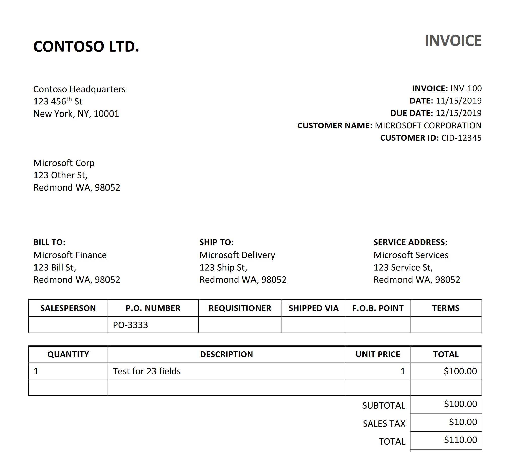

---
lab:
  title: 使用預先建立的 Azure AI 文件智慧服務模型分析表單
  description: 使用預先建置的 Azure AI 文件智慧服務模型，處理文件內的文字欄位。
---

# 使用預先建立的 Azure AI 文件智慧服務模型分析表單

在這項練習中，您會設定 Azure AI Foundry 專案，並在其中包含文件分析的所有必要資源。 您會同時使用 Azure AI Foundry 入口網站和 Python SDK，將表單提交至該資源進行分析。

雖然本練習是以 Python 為基礎，您仍可使用多種特定語言 SDK 來開發類似的應用程式，包括：

- [適用於 Python 的 Azure AI 文件智慧服務用戶端程式庫](https://pypi.org/project/azure-ai-formrecognizer/)
- [適用於 Microsoft .NET 的 Azure AI 文件智慧服務用戶端程式庫](https://www.nuget.org/packages/Azure.AI.FormRecognizer)
- [適用於 JavaScript 的 Azure AI 文件智慧服務用戶端程式庫](https://www.npmjs.com/package/@azure/ai-form-recognizer)

本練習大約需要 **30** 分鐘的時間。

## 建立 Azure AI Foundry 專案

讓我們從建立 Azure AI Foundry 專案開始。

1. 在網頁瀏覽器中，開啟 [Azure AI Foundry 入口網站](https://ai.azure.com) 於`https://ai.azure.com` 並使用您的 Azure 認證登入。 關閉首次登入時開啟的所有提示或快速啟動窗格，如有必要，使用左上角的 **Azure AI Foundry** 標誌瀏覽到首頁，首頁類似於下圖（若 [說明]**** 窗格已開啟，請將其關閉）：

    

1. 在瀏覽器中，先瀏覽至 `https://ai.azure.com/managementCenter/allResources`，再選取 [建立新項目]****。 然後選擇選項，以便建立**新的 AI 中心資源**。
1. 在 [建立專案]**** 精靈中，輸入專案有效名稱，然後選取建立新中樞的選項。 接著使用 [重新命名中樞]**** 連結，為新中樞指定有效名稱，展開 [進階選項]****，然後指定專案的下列設定：
    - **訂用帳戶**：您的 Azure 訂用帳戶**
    - **資源群組**：建立或選取資源群組**
    - **區域**： *任何可用地區*

    > **注意**：如果您位處使用原則來限制允許之資源名稱的 Azure 訂閱中，則可能需要使用 [建立新專案]**** 對話方塊底部的連結，才能使用 Azure 入口網站建立中樞。

    > **秘訣**：如果 [建立]**** 按鈕仍然停用，請將您的中樞重新命名為唯一的英數字元值。

1. 等候您的專案建立。
1. 建立專案後，關閉顯示的所有提示並檢閱 Azure AI Foundry 入口網站中的專案頁面，該頁面應類似於下圖：

    

## 使用 Read 模型

讓我們從使用 **Azure AI Foundry** 入口網站和「讀取」模型開始，使用多種語言分析文件：

1. 在左側的瀏覽面板中，選取 [AI 服務]****。
1. 在 [Azure AI 服務]**** 頁面中，選取 [視覺 + 文件]**** 圖格。
1. 在 [視覺 + 文件]**** 頁面中，驗證已選取 [文件]**** 分頁，然後選取 [OCR/讀取]**** 圖格。

    在 [讀取]**** 頁面中，用您專案建立的 Azure AI 服務資源應該已經連接。

1. 在左側的文件清單中，選取 [read-german.pdf]****。

    ![顯示 Azure AI 文件智慧服務工作室中 [讀取] 頁面的螢幕擷取畫面。](./media/read-german-sample.png#lightbox)

1. 在頂端工具列上，選取 [分析選項]****，然後在 [分析選項]**** 窗格中啟用 [語言]**** 核取方塊 (位於 [選擇性偵測]**** 下方)，然後選取 [儲存]****。 
1. 從左上方選取 [執行分析]****。
1. 在分析完成之後，系統從影像中擷取的文字會顯示在右側的 [Content]**** \(內容\) 索引標籤中。請檢閱此文字並將其與原始影像中的文字比較以確認精確度。
1. 選取 [Result]**** \(結果\) 索引標籤。此索引標籤會顯示擷取的 JSON 程式碼。 

## 準備在 Cloud Shell 中開發應用程式

現在我們來探索使用 Azure 文件智慧服務 SDK 的應用程式。 您將使用 Cloud Shell 開發應用程式。 您應用程式的程式碼檔案已在 GitHub 存放庫中提供。

這是將由您程式碼分析的發票。



1. 在 Azure AI Foundry 入口網站中，檢視專案的**概觀**頁面。
1. 在 [端點和金鑰]**** 區域中，選取 [Azure AI 服務]**** 分頁，並記下 **API 金鑰**和 **Azure AI 服務端點**。 您將使用這些認證，在用戶端應用程式中連接至 Azure AI 服務。
1. 開啟一個新的瀏覽器索引標籤（保持 Azure AI Foundry 入口網站在現有索引標籤中開啟）。 然後在新索引標籤中，瀏覽到 `https://portal.azure.com` 的 [Azure 入口網站](https://portal.azure.com)；如果出現提示，請使用您的 Azure 認證登入。
1. 使用頁面頂部搜尋欄右側的 **[\>_]** 按鈕在 Azure 入口網站中建立一個新的 Cloud Shell，並選擇 ***PowerShell*** 環境。 Cloud Shell 會在 Azure 入口網站底部的窗格顯示命令列介面。

    > **注意**：如果您之前建立了使用 *Bash* 環境的 Cloud Shell，請將其切換到 ***PowerShell***。

1. 在 Cloud Shell 工具列中，在**設定**功能表中，選擇**轉到經典版本**（這是使用程式碼編輯器所必需的）。

    **<font color="red">繼續之前，請先確定您已切換成 Cloud Shell 傳統版本。</font>**

1. 在 PowerShell 窗格中，輸入以下命令來複製此練習的 GitHub 存放庫：

    ```
   rm -r mslearn-ai-info -f
   git clone https://github.com/microsoftlearning/mslearn-ai-information-extraction mslearn-ai-info
    ```

    > **提示**：當您將命令貼到 Cloud Shell 中時，輸出可能會佔用大量的螢幕緩衝區。 您可以透過輸入 `cls` 命令來清除螢幕，以便更輕鬆地專注於每個工作。

    ***現在按照您選擇的程式設計語言的步驟進行操作。***

1. 複製存放庫之後，瀏覽至包含程式碼檔案的資料夾：

    ```
   cd mslearn-ai-info/Labfiles/prebuilt-doc-intelligence/Python
    ```

1. 在 Cloud Shell 命令列窗格中，輸入下列命令來安裝您將使用的程式庫：

    ```
   python -m venv labenv
   ./labenv/bin/Activate.ps1
   pip install -r requirements.txt azure-ai-formrecognizer==3.3.3
    ```

1. 輸入以下命令，編輯已提供的設定檔：

    ```
   code .env
    ```

    程式碼編輯器中會開啟檔案。

1. 在程式碼檔案中，將 **YOUR_ENDPOINT** 和 **YOUR_KEY** 預留位置取代為您的 Azure AI 服務端點及其 API 金鑰 (從 Azure AI Foundry 入口網站複製)。
1. 取代預留位置後，在程式碼編輯器中使用 **CTRL+S** 命令儲存變更，然後使用 **CTRL+Q** 命令關閉程式碼編輯器，同時保持 Cloud Shell 命令列開啟。

## 新增程式碼以使用 Azure 文件智慧服務

現在您已準備好使用 SDK 來評估 pdf 檔案。

1. 輸入以下命令，編輯系統提供的應用程式檔案：

    ```
   code document-analysis.py
    ```

    程式碼編輯器中會開啟檔案。

1. 在程式碼檔案中，尋找「**匯入必要程式庫**」註解，然後新增下列程式碼：

    ```python
   # Add references
   from azure.core.credentials import AzureKeyCredential
   from azure.ai.formrecognizer import DocumentAnalysisClient
    ```

1. 尋找「**建立用戶端**」註解，然後新增下列程式碼 (請務必維持正確的縮排等級)：

    ```python
   # Create the client
   document_analysis_client = DocumentAnalysisClient(
        endpoint=endpoint, credential=AzureKeyCredential(key)
   )
    ```

1. 尋找「**分析發票**」註解，然後新增下列程式碼：

    ```python
   # Analyse the invoice
   poller = document_analysis_client.begin_analyze_document_from_url(
        fileModelId, fileUri, locale=fileLocale
   )
    ```

1. 尋找「**向使用者顯示發票資訊**」註解，然後新增下列程式碼：

    ```python
   # Display invoice information to the user
   receipts = poller.result()
    
   for idx, receipt in enumerate(receipts.documents):
    
        vendor_name = receipt.fields.get("VendorName")
        if vendor_name:
            print(f"\nVendor Name: {vendor_name.value}, with confidence {vendor_name.confidence}.")

        customer_name = receipt.fields.get("CustomerName")
        if customer_name:
            print(f"Customer Name: '{customer_name.value}, with confidence {customer_name.confidence}.")


        invoice_total = receipt.fields.get("InvoiceTotal")
        if invoice_total:
            print(f"Invoice Total: '{invoice_total.value.symbol}{invoice_total.value.amount}, with confidence {invoice_total.confidence}.")
    ```

1. 在程式碼編輯器中，用 **CTRL+S** 命令或**按下滑鼠右鍵 > [儲存]**，即可儲存變更。 請讓程式碼編輯器保持開啟，以便修正程式碼出現的任何錯誤，但請調整窗格大小，以利清楚查看命令列窗格。

1. 在命令列窗格中，輸入下列命令來執行應用程式。

    ```
    python document-analysis.py
    ```

程式會搭配信賴等級顯示廠商名稱、客戶名稱和發票總計。 將其所報告的值，與您在此節開頭開啟的範例發票互相比較。

## 清理

如果您已完成使用 Azure 資源，請記得刪除 [Azure 入口網站](https://portal.azure.com) (`https://portal.azure.com`) 中的資源，以免產生更多費用。
